# 🏗️ EatFast Mobile App - Technical Architecture

## 📋 System Architecture Overview

### Clean Architecture Implementation
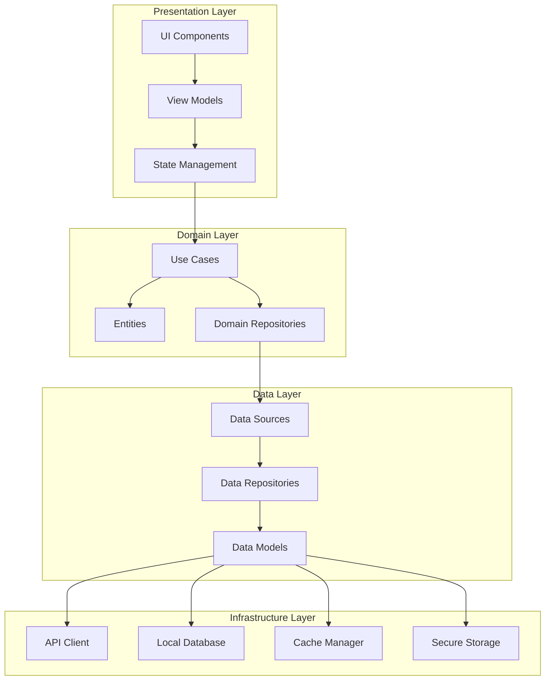

---

## 🔧 Core Architecture Components

### 1. State Management Architecture (Riverpod)
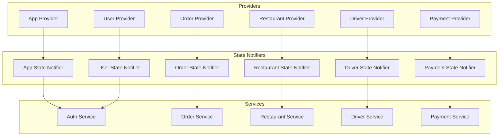

### 2. Navigation Architecture (GoRouter)
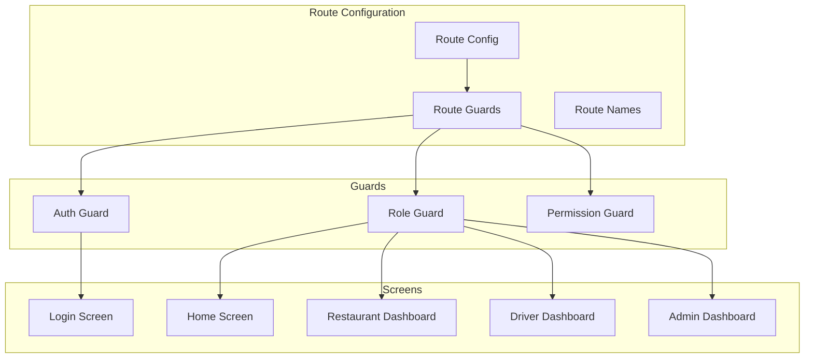

---

## 📱 Feature Module Architecture

### Modular Feature Structure
```
lib/
├── core/
│   ├── auth/
│   │   ├── domain/
│   │   │   ├── models/
│   │   │   ├── repositories/
│   │   │   └── usecases/
│   │   ├── data/
│   │   │   ├── models/
│   │   │   ├── repositories/
│   │   │   └── datasources/
│   │   └── presentation/
│   │       ├── providers/
│   │       ├── screens/
│   │       └── widgets/
│   ├── router/
│   ├── theme/
│   ├── utils/
│   └── widgets/
├── features/
│   ├── home/
│   │   ├── domain/
│   │   ├── data/
│   │   └── presentation/
│   ├── restaurant_owner/
│   │   ├── domain/
│   │   ├── data/
│   │   └── presentation/
│   ├── driver/
│   │   ├── domain/
│   │   ├── data/
│   │   └── presentation/
│   ├── admin/
│   │   ├── domain/
│   │   ├── data/
│   │   └── presentation/
│   ├── orders/
│   ├── payments/
│   ├── promotions/
│   ├── ratings/
│   ├── tips/
│   ├── favorites/
│   ├── notifications/
│   ├── analytics/
│   └── ai_recommendations/
├── shared/
│   ├── models/
│   ├── widgets/
│   ├── utils/
│   └── constants/
└── main.dart
```

---

## 🔄 Data Flow Architecture

### Complete Data Flow
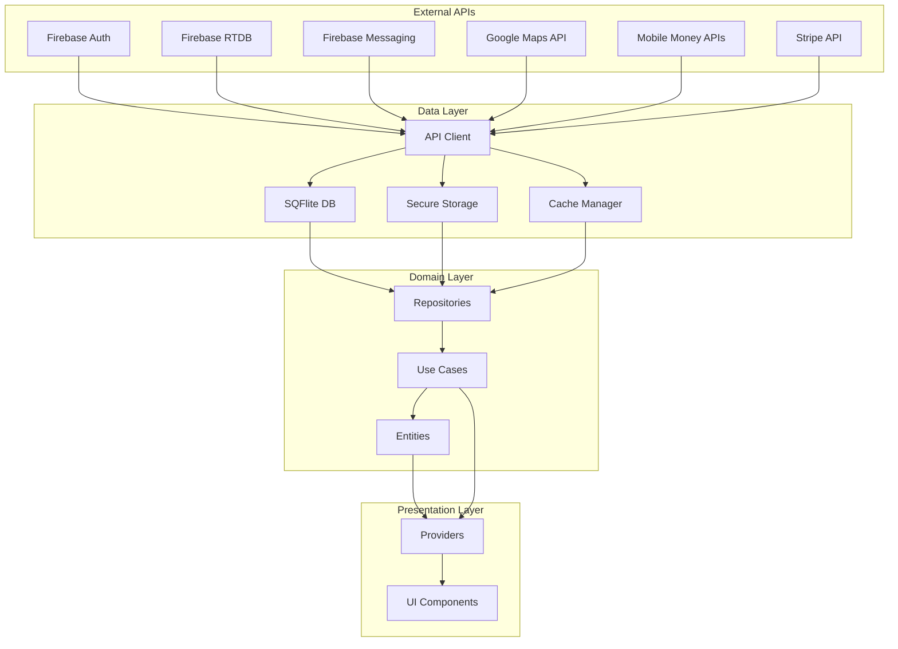

---

## 🗄️ Database Architecture

### Local Database Schema
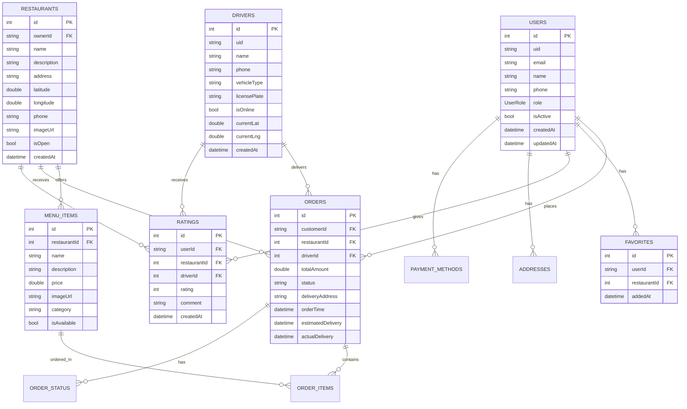

---

## 🔐 Security Architecture

### Authentication & Authorization Flow
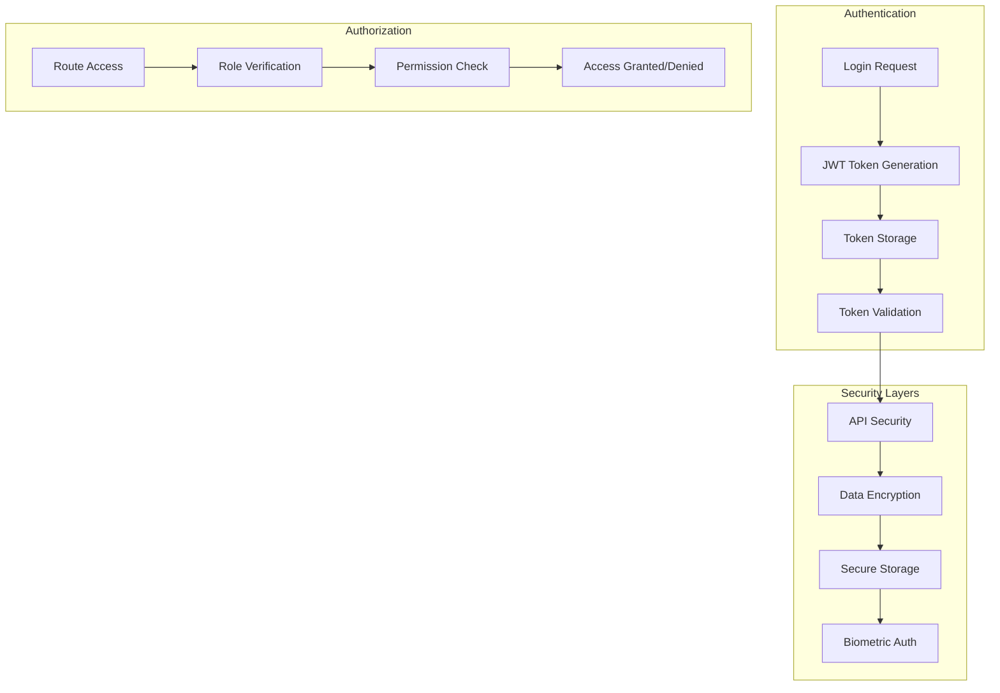

---

## 📡 API Architecture

### Backend Integration Pattern
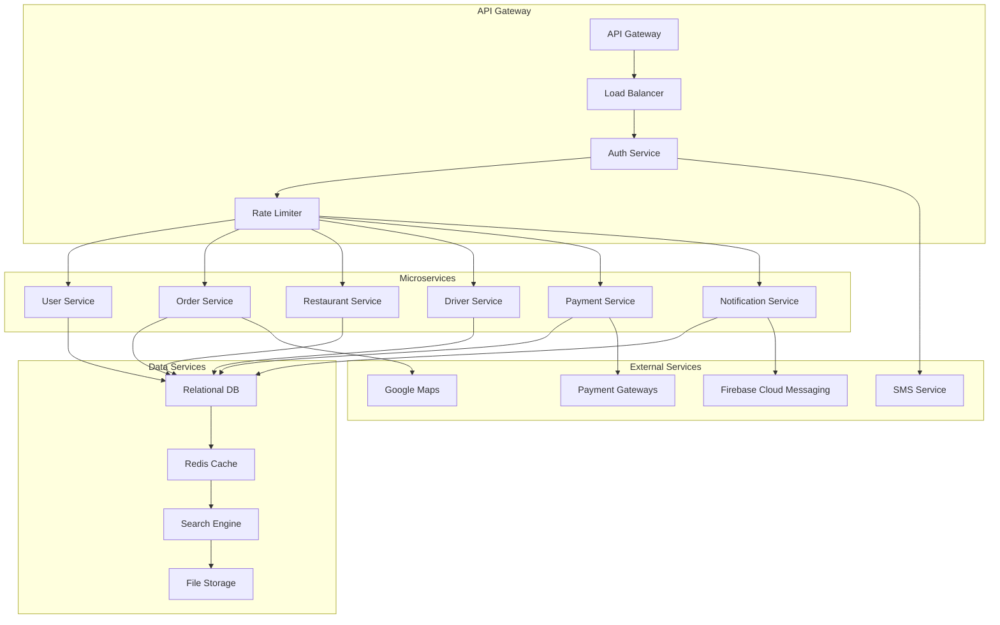

---

## 🔄 Real-time Architecture

### Live Updates System
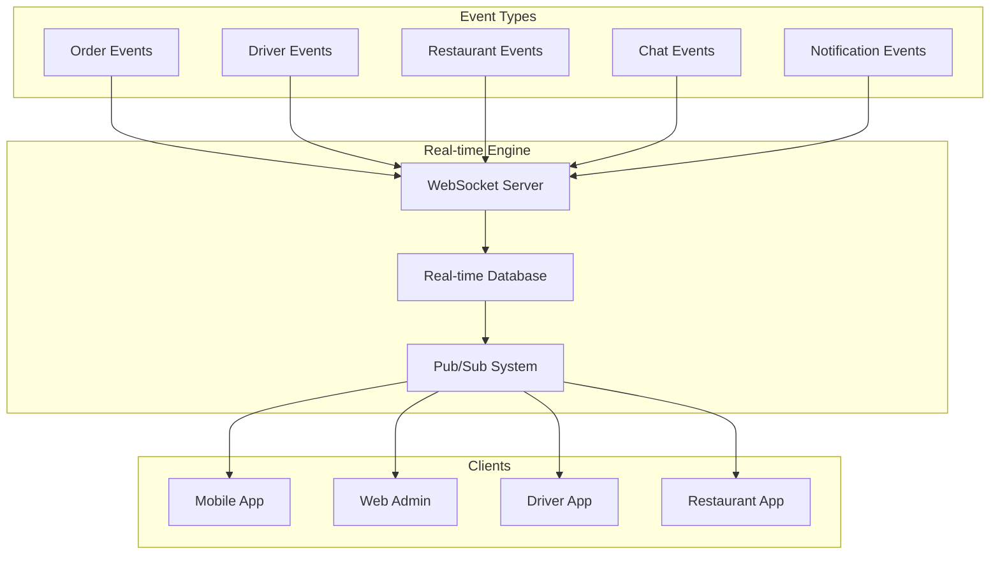

---

## 📊 Analytics & Monitoring Architecture

### Observability Stack
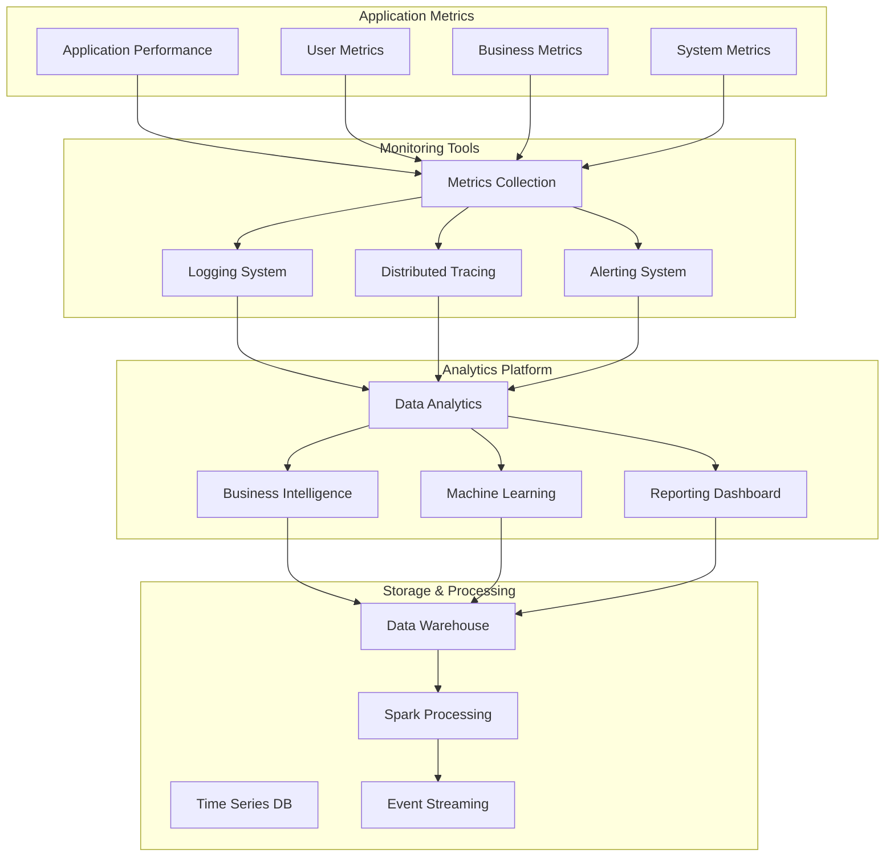

---

## 🚀 Deployment & DevOps Architecture

### CI/CD Pipeline
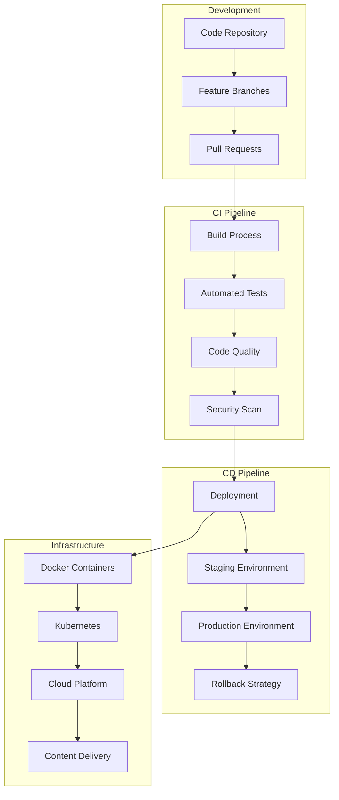

---

## 📱 Mobile-Specific Architecture

### Platform-Specific Implementation
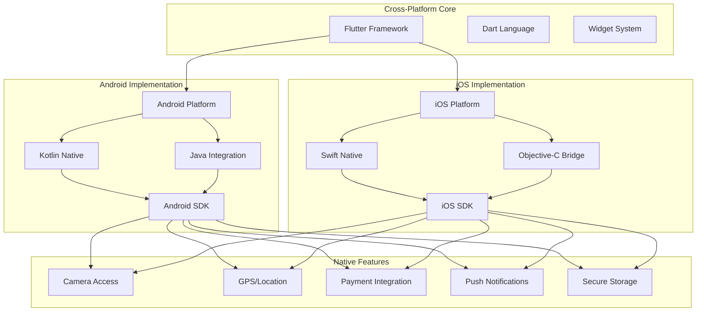

This technical architecture documentation provides a comprehensive view of the EatFast mobile application's system design, data flows, security measures, and deployment strategies.
