# 📊 EatFast Mobile App - User Flow Diagrams

## 🎯 Complete User Journey Maps

### 1. Customer User Flow
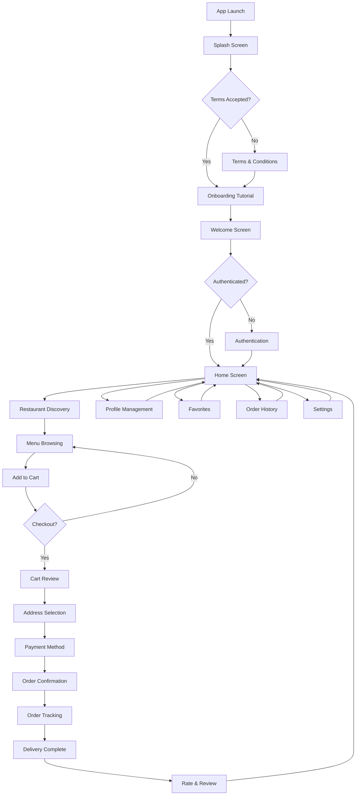

### 2. Restaurant Owner Flow
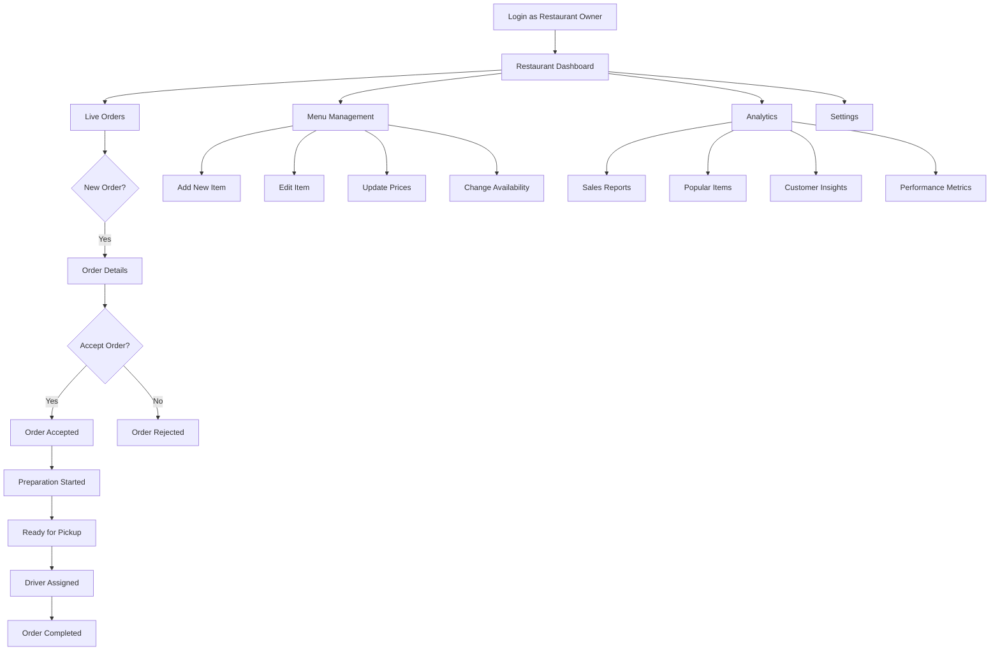

### 3. Driver Flow
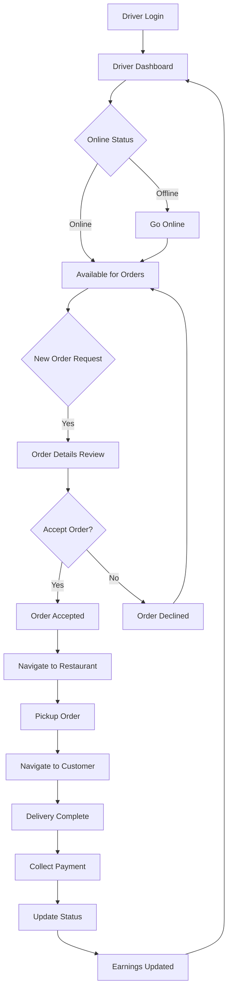

### 4. Admin Flow
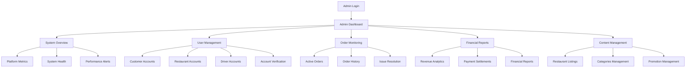

---

## 🔄 Complete Application State Flow

### Authentication State Flow
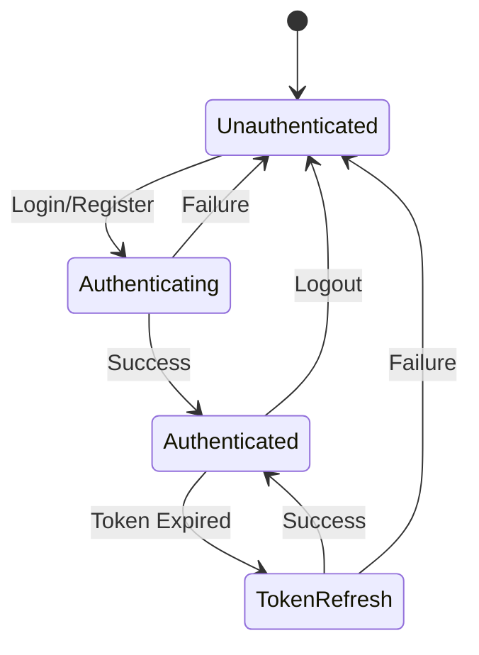

### Order State Flow
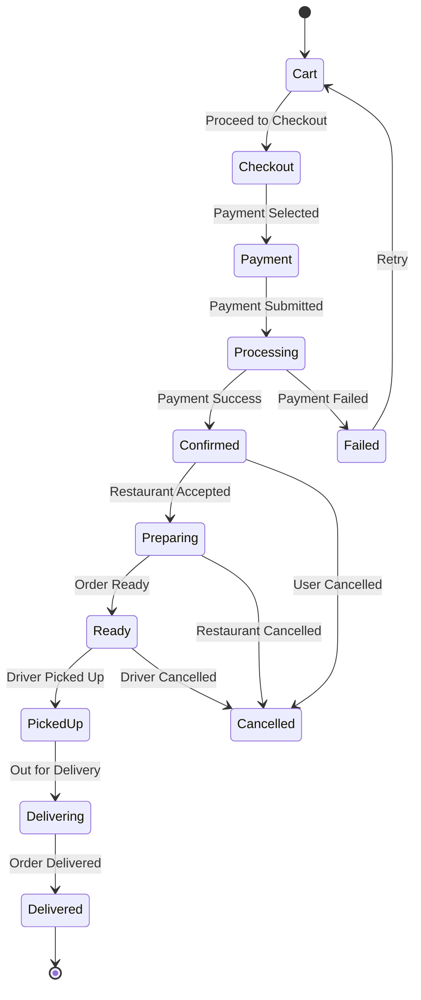

### Driver Availability Flow
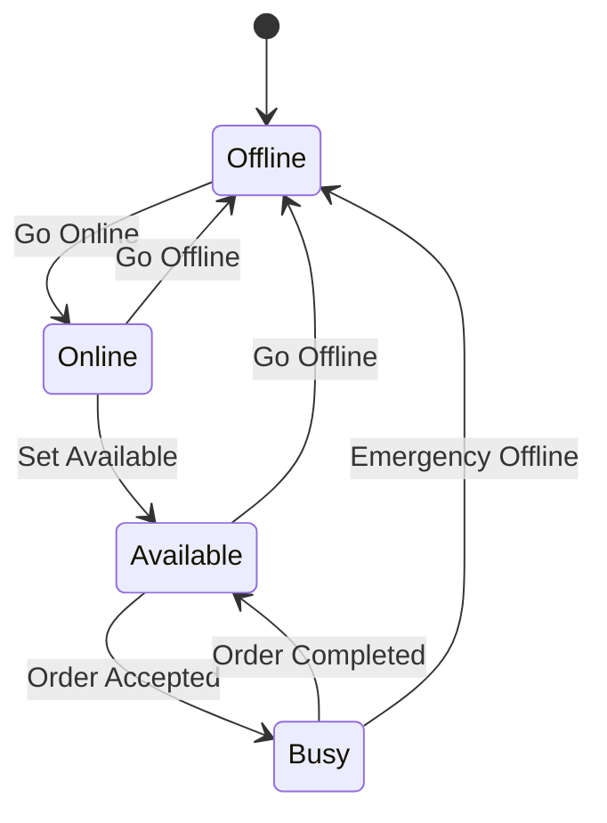

---

## 📱 Screen Navigation Flow

### Main Navigation Structure
```
├── Splash Screen
├── Onboarding Flow
│   ├── Terms & Conditions
│   ├── Welcome Screen
│   └── Tutorial Screens
├── Authentication Flow
│   ├── Login Screen
│   ├── Register Screen
│   ├── Forgot Password
│   └── OTP Verification
├── Main App (Role-based)
│   ├── Customer Interface
│   │   ├── Home Screen (Bottom Navigation)
│   │   │   ├── Home Tab
│   │   │   ├── Restaurants Tab
│   │   │   ├── Orders Tab
│   │   │   └── Profile Tab
│   │   ├── Restaurant Detail
│   │   ├── Menu Screen
│   │   ├── Cart Screen
│   │   ├── Checkout Screen
│   │   ├── Order Tracking
│   │   ├── Order History
│   │   ├── Profile Management
│   │   ├── Settings
│   │   └── Language Settings
│   ├── Restaurant Owner Interface
│   │   ├── Restaurant Dashboard
│   │   ├── Order Management
│   │   ├── Menu Management
│   │   ├── Analytics
│   │   └── Settings
│   ├── Driver Interface
│   │   ├── Driver Dashboard
│   │   ├── Order Acceptance
│   │   ├── Delivery Tracking
│   │   ├── Earnings
│   │   └── Settings
│   └── Admin Interface
│       ├── Admin Dashboard
│       ├── User Management
│       ├── Order Monitoring
│       ├── Analytics
│       └── System Settings
└── Shared Screens
    ├── About Us
    ├── Our Team
    ├── Contact Us
    └── Error Screens
```

---

## 🔐 Authentication & Authorization Flow

### Multi-Role Authentication
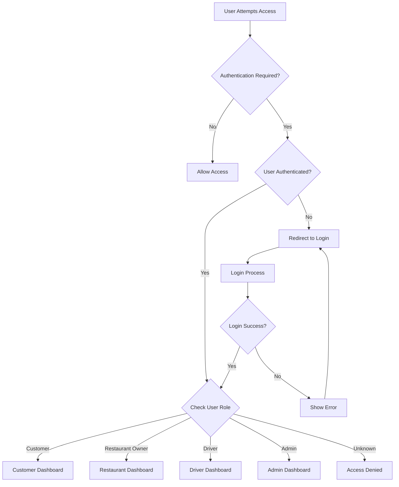

### Route Guard Implementation
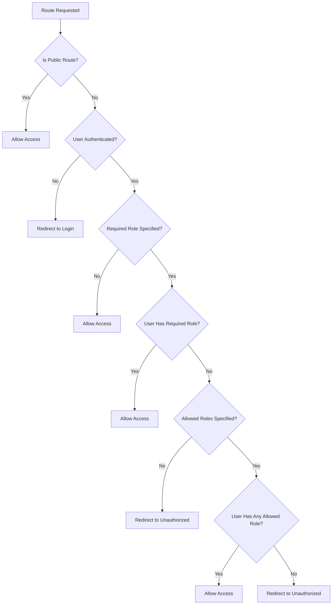

---

## 💳 Payment & Checkout Flow

### Complete Checkout Process
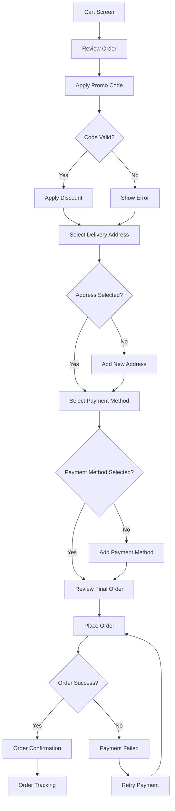

### Payment Method Flow
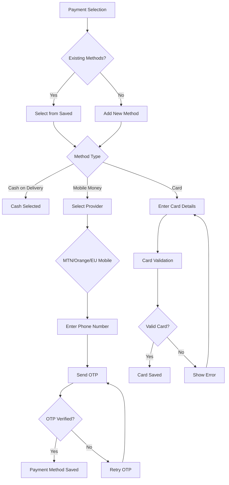

---

## 📦 Order Management Flow

### Order Lifecycle
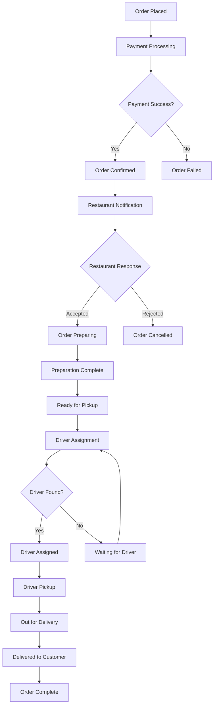

### Real-time Order Tracking
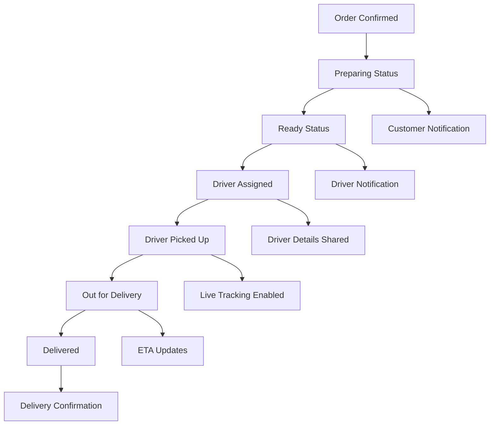

---

## 🎯 Key User Experience Flows

### Seamless Onboarding
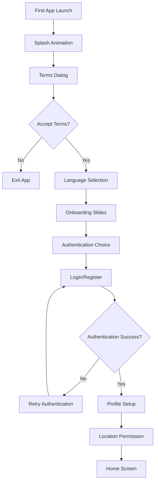

### Personalized Home Experience
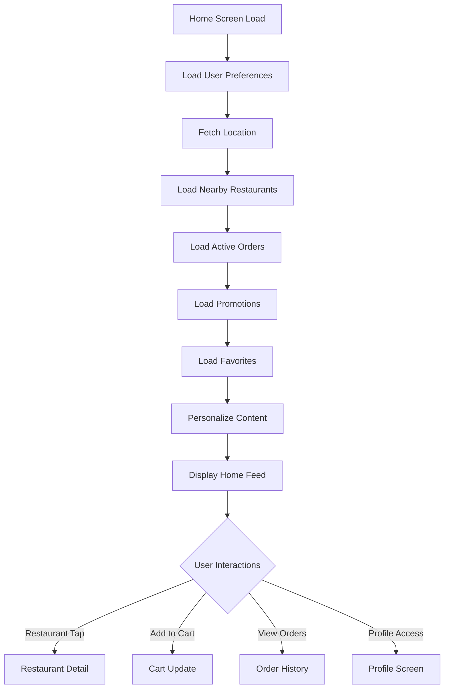

---

## 🔄 Data Synchronization Flow

### Offline-Online Synchronization
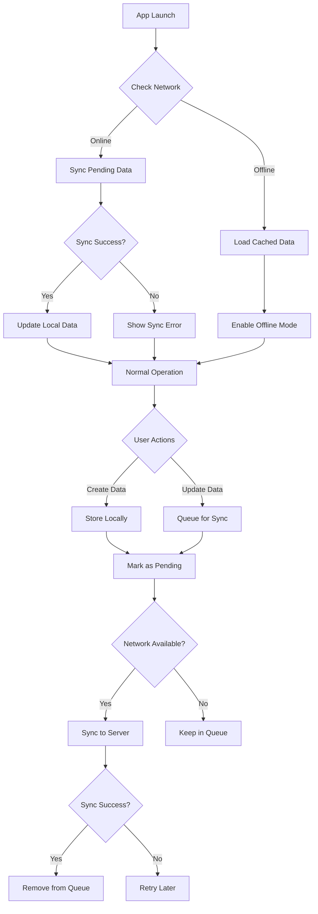

---

## 🚨 Error Handling & Recovery Flow

### Comprehensive Error Management
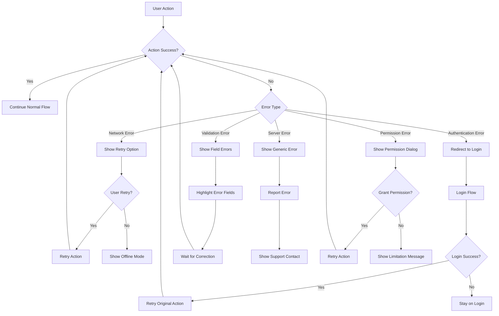

---

## 📊 Analytics & Performance Monitoring

### User Behavior Tracking
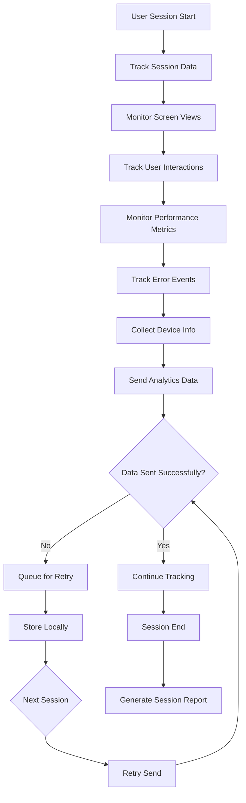

This comprehensive flow documentation provides a complete overview of the EatFast mobile application's user journeys, state management, and interaction patterns across all user roles and features.
