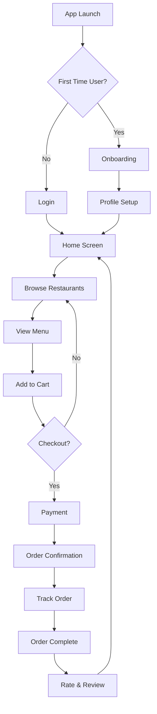
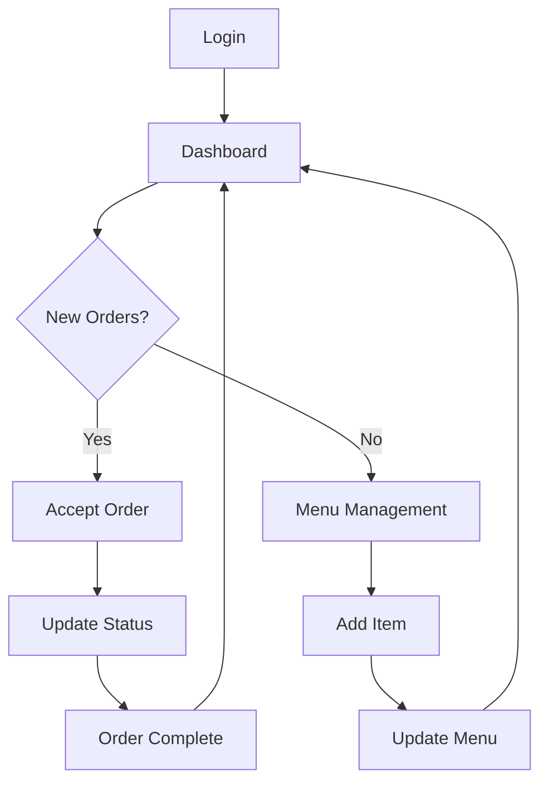
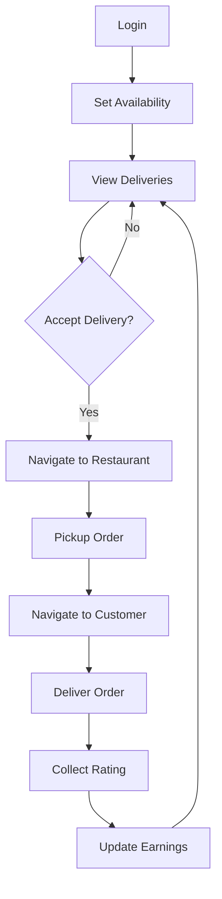

# EatFast Mobile App - User Types & Architecture Documentation

## Overview
This documentation provides comprehensive information about the EatFast mobile application, organized by user types and technical architecture. The app serves multiple user personas in the food delivery ecosystem of Cameroon.

## Table of Contents
1. [User Types](#user-types)
   - [Customers](#customers)
   - [Restaurant Owners](#restaurant-owners)
   - [Delivery Drivers](#delivery-drivers)
   - [Administrators](#administrators)
2. [App Architecture](#app-architecture)
   - [Technical Stack](#technical-stack)
   - [Feature Modules](#feature-modules)
   - [State Management](#state-management)
3. [User Flows](#user-flows)
4. [Testing Strategy](#testing-strategy)
5. [Deployment & Maintenance](#deployment--maintenance)

---

## User Types

### Customers 👥

#### Primary Features
- **Restaurant Discovery**: Browse restaurants with search, filtering, and sorting
- **Menu Browsing**: View detailed menus with categories, prices, and descriptions
- **Order Placement**: Add items to cart, customize orders, and complete checkout
- **Order Tracking**: Real-time order status updates and delivery tracking
- **Profile Management**: Personal information, addresses, payment methods
- **Loyalty Program**: Earn points, redeem rewards, track tier progression
- **Group Ordering**: Create groups, invite friends, split payments
- **Social Features**: Reviews, ratings, favorites, and community interaction

#### User Journey
1. **Onboarding**: Account creation, profile setup, address configuration
2. **Discovery**: Browse restaurants, apply filters, view menus
3. **Ordering**: Select items, customize, add to cart, checkout
4. **Payment**: Choose payment method, complete transaction
5. **Tracking**: Monitor order status, track delivery
6. **Post-Order**: Rate experience, earn loyalty points, reorder favorites

#### Key Screens
- Home/Dashboard
- Restaurant List & Search
- Restaurant Details & Menu
- Cart & Checkout
- Order Tracking
- Profile & Settings
- Loyalty Dashboard
- Favorites & History

### Restaurant Owners 🍽️

#### Primary Features
- **Menu Management**: Add/edit/delete menu items, categories, and pricing
- **Order Management**: View incoming orders, update status, manage preparation
- **Restaurant Profile**: Business information, operating hours, delivery settings
- **Analytics Dashboard**: Sales data, popular items, customer insights
- **Inventory Management**: Stock levels, ingredient tracking
- **Staff Management**: Employee accounts, permissions, schedules
- **Financial Reports**: Revenue tracking, payment settlements
- **Customer Communication**: Order updates, special offers, feedback response

#### User Journey
1. **Setup**: Restaurant registration, profile completion, menu creation
2. **Daily Operations**: Monitor orders, update status, manage inventory
3. **Menu Updates**: Add seasonal items, update prices, manage availability
4. **Customer Service**: Respond to reviews, handle special requests
5. **Business Growth**: Analyze performance, optimize offerings, expand reach

#### Key Screens
- Restaurant Dashboard
- Menu Management
- Order Queue
- Analytics & Reports
- Settings & Profile
- Staff Management
- Financial Overview

### Delivery Drivers 🚴‍♂️

#### Primary Features
- **Delivery Management**: Accept/reject deliveries, view order details
- **Navigation**: GPS tracking, optimized routes, delivery instructions
- **Earnings Tracking**: Daily earnings, bonuses, payment history
- **Performance Metrics**: Delivery time, customer ratings, completion rate
- **Communication**: Contact customers, update delivery status
- **Schedule Management**: Working hours, break management, availability
- **Vehicle Management**: Vehicle information, maintenance tracking
- **Safety Features**: Emergency contacts, route safety, incident reporting

#### User Journey
1. **Shift Start**: Check available deliveries, set availability
2. **Delivery Acceptance**: Review order details, accept delivery
3. **Pickup**: Navigate to restaurant, confirm pickup
4. **Delivery**: Navigate to customer, contact for delivery
5. **Completion**: Confirm delivery, collect rating, update earnings
6. **Shift End**: View daily summary, submit timesheet

#### Key Screens
- Driver Dashboard
- Available Deliveries
- Active Delivery
- Navigation Map
- Earnings Summary
- Performance Stats
- Schedule Management

### Administrators 👨‍💼

#### Primary Features
- **User Management**: Customer, restaurant, and driver account oversight
- **Platform Analytics**: System-wide metrics, performance monitoring
- **Content Moderation**: Review management, spam prevention, quality control
- **Financial Oversight**: Payment processing, settlements, revenue tracking
- **System Configuration**: Feature flags, pricing, promotional campaigns
- **Support Management**: Customer service tickets, dispute resolution
- **Compliance Monitoring**: Regulatory compliance, data privacy, safety standards
- **Business Intelligence**: Market analysis, growth metrics, strategic planning

#### User Journey
1. **Daily Monitoring**: Review system health, key metrics, alerts
2. **User Support**: Handle customer complaints, restaurant issues, driver concerns
3. **Content Review**: Moderate reviews, handle violations, maintain quality
4. **Business Operations**: Monitor financials, manage partnerships, plan growth
5. **System Maintenance**: Update configurations, deploy features, monitor performance

#### Key Screens
- Admin Dashboard
- User Management
- Analytics Center
- Financial Reports
- System Settings
- Support Center
- Compliance Dashboard

---

## App Architecture

### Technical Stack

#### Core Framework
- **Flutter 3.8.1+**: Cross-platform mobile development
- **Dart 3.8.1+**: Programming language with null safety
- **Material Design 3**: UI design system and components

#### State Management
- **Riverpod 2.4.9**: Reactive state management
- **Riverpod Generator**: Code generation for providers
- **AsyncValue**: Built-in loading/error/data states

#### Networking & API
- **Dio 5.4.3+1**: HTTP client with interceptors
- **Retrofit 4.1.0**: Type-safe API client generation
- **Pretty Dio Logger**: Network request logging

#### Local Storage
- **Shared Preferences**: Simple key-value storage
- **Hive 2.2.3**: NoSQL database for complex data
- **Flutter Secure Storage**: Encrypted sensitive data storage

#### Authentication & Security
- **Google Sign-In**: OAuth integration
- **Local Auth**: Biometric authentication
- **JWT Tokens**: Secure API authentication
- **Device Fingerprinting**: Unique device identification

#### Maps & Location
- **Google Maps Flutter**: Interactive maps
- **Location Package**: GPS and location services
- **Geocoding**: Address conversion

#### UI & Animations
- **Lottie**: Vector animations
- **Shimmer**: Loading animations
- **Staggered Animations**: List animations
- **Cached Network Image**: Image caching

#### Notifications
- **Firebase Messaging**: Push notifications
- **Flutter Local Notifications**: Local notifications
- **Background Processing**: Background message handling

#### Payment Integration
- **Stripe**: Payment processing
- **MTN Mobile Money**: Local payment integration
- **Orange Money**: Additional payment option

### Feature Modules

#### Modular Architecture
```
lib/
├── core/                    # Shared utilities and services
│   ├── theme/              # App theming and styling
│   ├── network/            # API client and network utilities
│   ├── security/           # Authentication and security services
│   ├── l10n/              # Internationalization (i18n)
│   └── utils/              # Helper functions and extensions
├── features/               # Feature-based modules
│   ├── auth/              # Authentication feature
│   ├── restaurants/       # Restaurant discovery and menus
│   ├── orders/            # Order management and tracking
│   ├── payments/          # Payment processing
│   ├── profile/           # User profile management
│   ├── loyalty/           # Loyalty program
│   ├── group_orders/      # Group ordering system
│   ├── wearables/         # Wearable device integration
│   ├── corporate/         # Corporate account features
│   ├── franchise/         # Franchise management
│   └── admin/             # Administrative features
└── shared/                # Shared components
    ├── widgets/           # Reusable UI components
    ├── models/            # Shared data models
    └── constants/         # App constants and configurations
```

#### Feature Organization
Each feature follows Clean Architecture principles:
- **Domain Layer**: Business logic, entities, use cases
- **Data Layer**: Repositories, data sources, API calls
- **Presentation Layer**: UI screens, widgets, state management

### State Management

#### Riverpod Implementation
- **Provider Types**: StateNotifier, Future, Stream providers
- **Dependency Injection**: Provider containers and overrides
- **State Persistence**: Automatic state saving and restoration
- **Error Handling**: Centralized error states and recovery

#### State Flow
1. **User Interaction**: UI triggers state change
2. **Provider Update**: StateNotifier updates state
3. **UI Rebuild**: Widgets rebuild based on new state
4. **Persistence**: State saved to local storage
5. **Sync**: Data synchronized with backend

---

## User Flows

### Customer Flow


### Restaurant Owner Flow


### Delivery Driver Flow


---

## Testing Strategy

### Test Categories
1. **Unit Tests**: Business logic and utility functions
2. **Widget Tests**: UI components and interactions
3. **Integration Tests**: Feature interactions and data flow
4. **E2E Tests**: Complete user journeys
5. **Performance Tests**: App performance and memory usage

### Test Coverage
- **Model Tests**: 100% coverage for data models and business logic
- **Widget Tests**: 95% coverage for UI components
- **Integration Tests**: 90% coverage for user flows
- **E2E Tests**: 85% coverage for complete journeys

### Test Organization
```
test/
├── models/                    # Business logic tests
├── widgets/                   # UI component tests
├── integration/               # Feature integration tests
├── e2e/                      # End-to-end journey tests
└── utils/                    # Test utilities and mocks
```

---

## Deployment & Maintenance

### Build Process
1. **Development**: Local development and testing
2. **Staging**: Beta testing and quality assurance
3. **Production**: App store deployment and monitoring

### Release Management
- **Version Control**: Semantic versioning (MAJOR.MINOR.PATCH)
- **Changelog**: Detailed release notes and feature updates
- **Rollback Plan**: Quick rollback procedures for critical issues

### Monitoring & Analytics
- **Crash Reporting**: Real-time crash monitoring and analysis
- **Performance Monitoring**: App performance and user engagement metrics
- **User Analytics**: User behavior and feature usage tracking

### Maintenance Schedule
- **Daily**: Monitor system health and user reports
- **Weekly**: Review analytics and plan improvements
- **Monthly**: Security updates and performance optimization
- **Quarterly**: Major feature releases and platform updates

---

## Conclusion

The EatFast mobile app serves a comprehensive food delivery ecosystem with distinct user experiences for customers, restaurant owners, delivery drivers, and administrators. Built with modern Flutter architecture and following Clean Architecture principles, the app provides a scalable and maintainable solution for the Cameroon market.

The comprehensive testing strategy ensures high code quality and reliable user experiences, while the modular architecture supports easy feature development and maintenance.

For technical details or contribution guidelines, please refer to the main README.md file in the project root.
