# 🔄 **EatFast Action Flows & Functionality Documentation**

**Version:** 1.0.0 (Production Ready)  
**Last Updated:** September 13, 2025  
**Status:** ✅ Production Deployment Ready

---

## 📋 **Table of Contents**
- [Overview](#overview)
- [Core Action Flows](#core-action-flows)
- [User Journey Mappings](#user-journey-mappings)
- [System Integration Flows](#system-integration-flows)
- [Real-time Communication Flows](#real-time-communication-flows)
- [Payment Processing Flows](#payment-processing-flows)
- [Error Handling Flows](#error-handling-flows)
- [Security Workflow](#security-workflow)

---

## 🎯 **Overview**

This document details the complete action flows and functionality of the EatFast food delivery platform, covering all user interactions, system processes, and integration workflows.

---

## 🔄 **Core Action Flows**

### 🛍️ **Complete Order Lifecycle Flow**

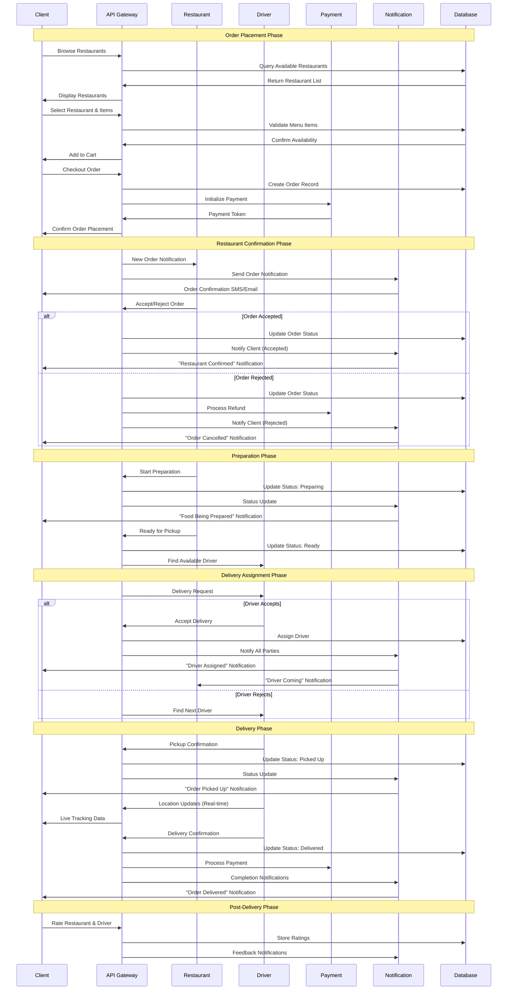

### 👤 **User Authentication Flow**

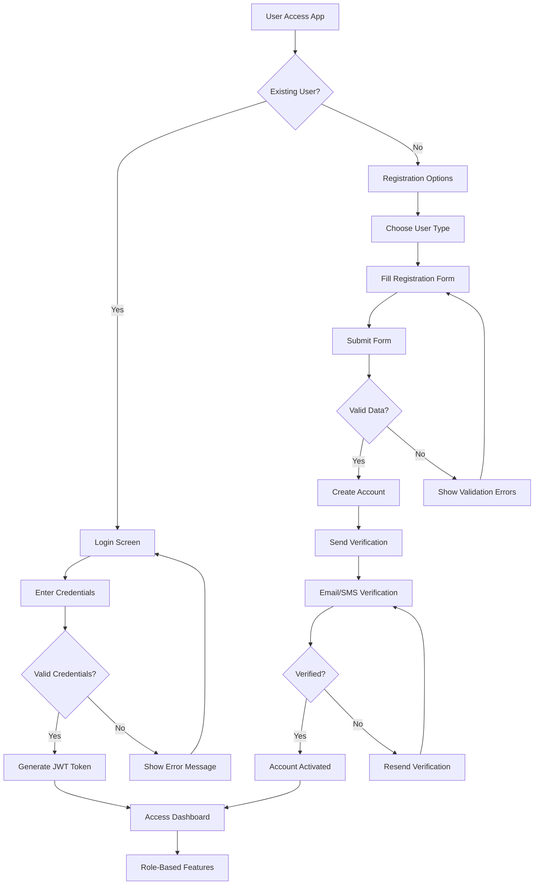

### 🏪 **Restaurant Onboarding Flow**

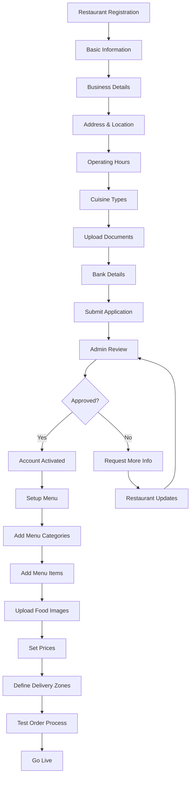

### 🚗 **Driver Onboarding & Assignment Flow**

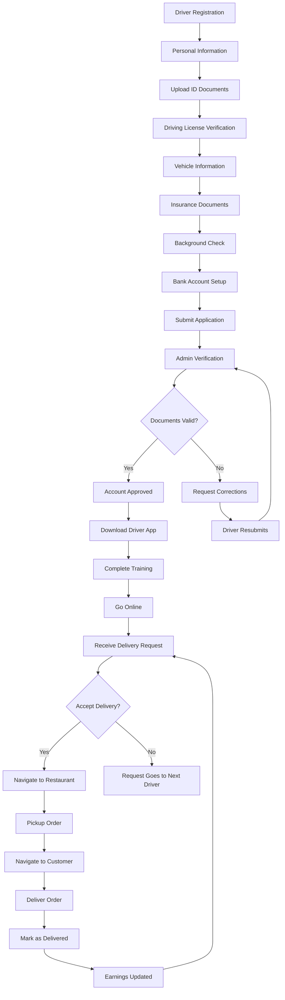

---

## 🗺️ **User Journey Mappings**

### 📱 **Client User Journey**

#### **First-Time User Journey**
1. **Discovery** → App download/website visit
2. **Exploration** → Browse restaurants as guest
3. **Registration** → Create account for order tracking
4. **First Order** → Complete checkout process
5. **Tracking** → Real-time order monitoring
6. **Delivery** → Receive food and rate experience
7. **Retention** → Return for future orders with saved preferences

#### **Returning User Journey**
1. **Quick Access** → One-click login
2. **Personalized Experience** → Recommended restaurants/dishes
3. **Express Checkout** → Saved addresses and payment methods
4. **Loyalty Benefits** → Points redemption and exclusive offers
5. **Social Features** → Share favorites, invite friends

### 🍽️ **Restaurant User Journey**

#### **Onboarding Journey**
1. **Registration** → Business application submission
2. **Verification** → Document review and approval
3. **Setup** → Menu creation and pricing
4. **Training** → Platform orientation
5. **Testing** → Trial orders and adjustments
6. **Launch** → Public restaurant listing

#### **Daily Operations Journey**
1. **Morning Setup** → Review menu availability
2. **Order Management** → Accept/reject incoming orders
3. **Preparation Tracking** → Update cooking status
4. **Quality Control** → Ensure food quality before pickup
5. **Performance Review** → Check ratings and feedback
6. **Analytics Review** → Sales and performance metrics

### 🚗 **Driver User Journey**

#### **Onboarding Journey**
1. **Application** → Submit personal and vehicle documents
2. **Verification** → Background and document checks
3. **Approval** → Account activation
4. **Training** → App usage and delivery protocols
5. **First Delivery** → Supervised delivery for quality assurance

#### **Daily Work Journey**
1. **Login** → Start shift and go online
2. **Availability** → Set working hours and zones
3. **Order Assignment** → Receive and accept delivery requests
4. **Navigation** → Optimal route planning
5. **Pickup** → Restaurant coordination
6. **Delivery** → Customer interaction and order completion
7. **Earnings** → Real-time earnings tracking

---

## 🔌 **System Integration Flows**

### 💳 **Payment Gateway Integration**

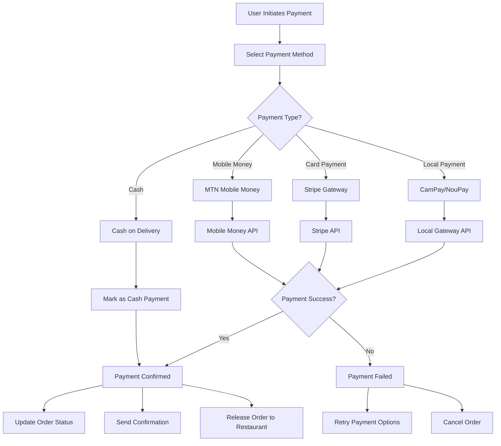

### 📧 **Notification System Integration**

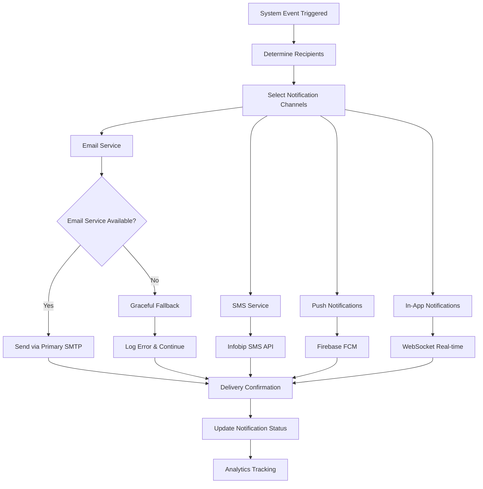

### 🗃️ **Database Transaction Flow**

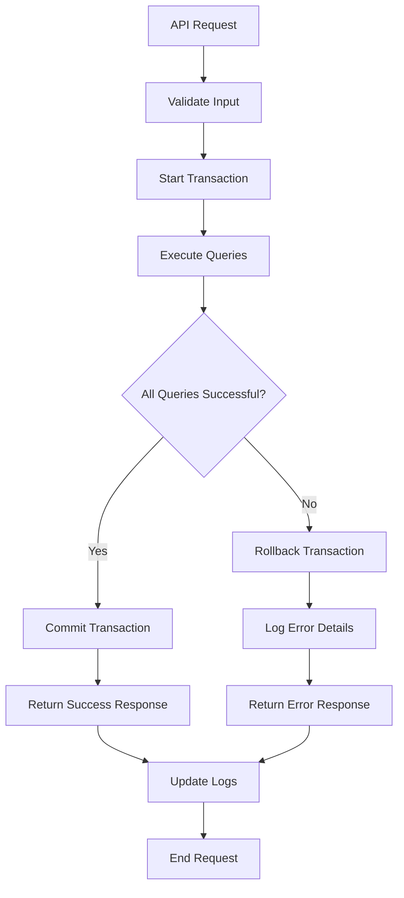

---

## 📡 **Real-time Communication Flows**

### 🔄 **WebSocket Connection Management**

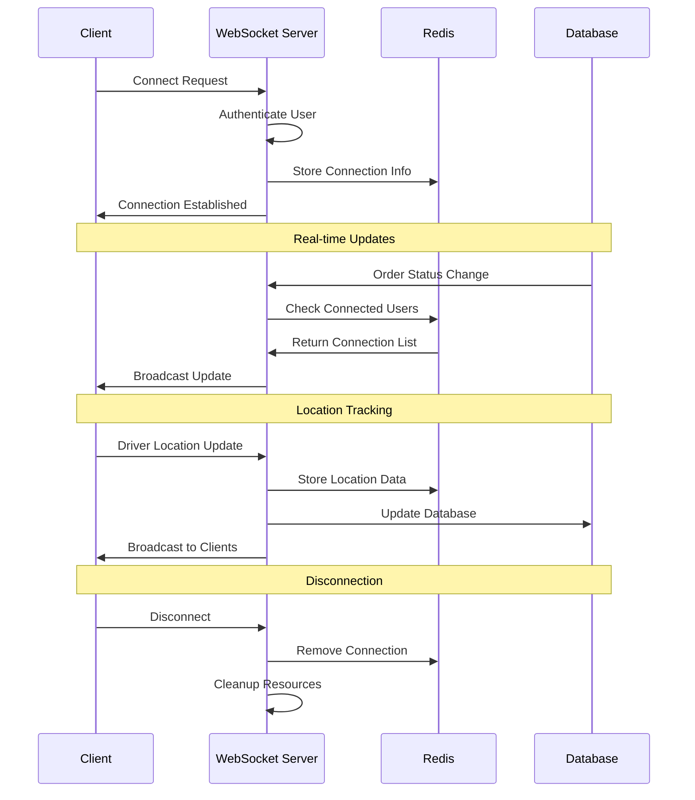

### 📍 **Live Order Tracking**

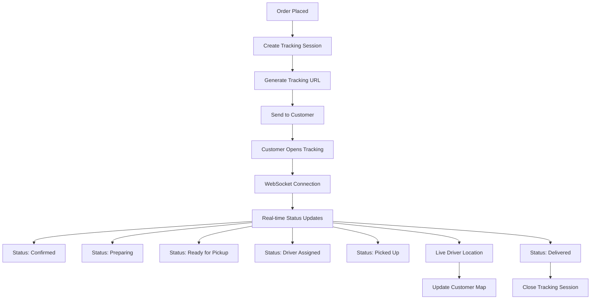

---

## 💰 **Payment Processing Flows**

### 🏦 **Multi-Gateway Payment Flow**

```javascript
// Payment Processing Logic
const processPayment = async (orderData, paymentMethod) => {
  try {
    // 1. Validate payment data
    const validation = await validatePaymentData(orderData);
    if (!validation.valid) throw new Error(validation.error);
    
    // 2. Initialize payment based on method
    let paymentResult;
    switch (paymentMethod.type) {
      case 'mobile_money':
        paymentResult = await processMobileMoneyPayment(orderData);
        break;
      case 'stripe':
        paymentResult = await processStripePayment(orderData);
        break;
      case 'local_gateway':
        paymentResult = await processLocalGateway(orderData);
        break;
      case 'cash':
        paymentResult = await processCashPayment(orderData);
        break;
    }
    
    // 3. Update order status
    await updateOrderPaymentStatus(orderData.orderId, paymentResult);
    
    // 4. Send notifications
    await sendPaymentConfirmation(orderData, paymentResult);
    
    return paymentResult;
    
  } catch (error) {
    await handlePaymentError(orderData, error);
    throw error;
  }
};
```

### 💸 **Refund Processing Flow**

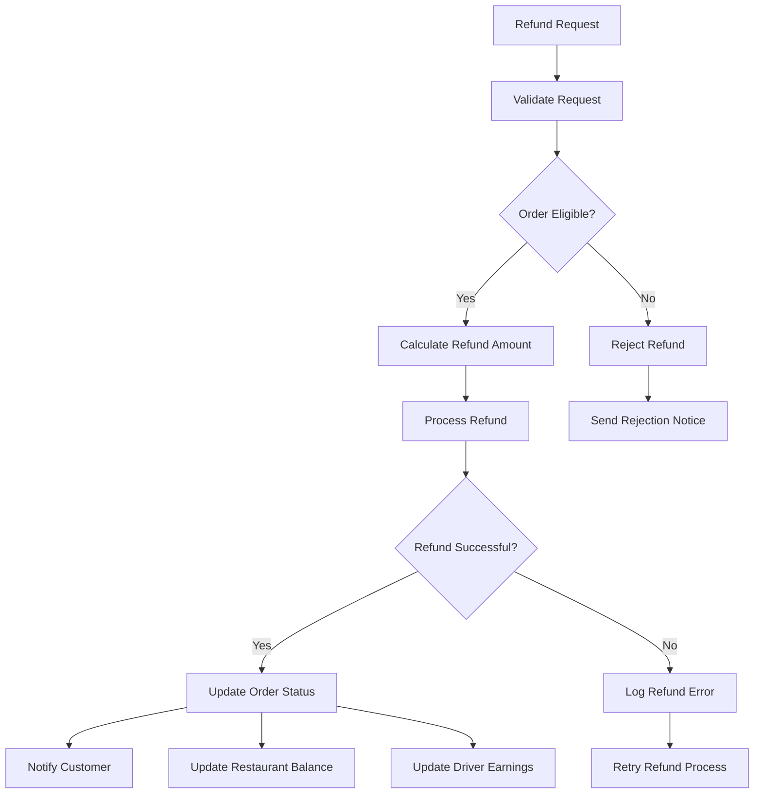

---

## ⚠️ **Error Handling Flows**

### 🚨 **System Error Management**

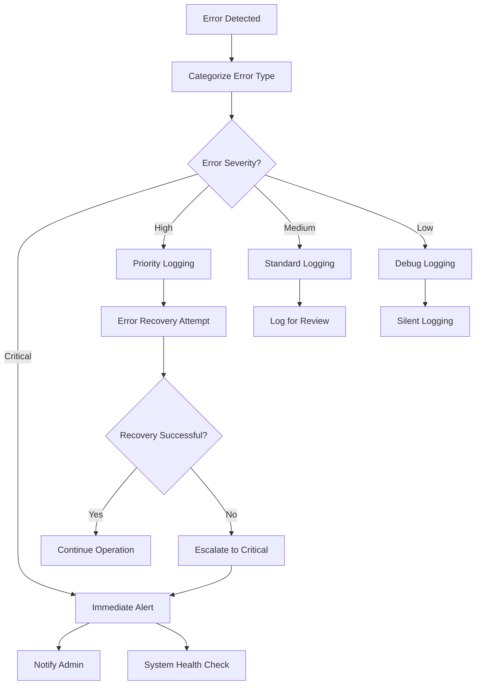

### 🔄 **Service Failover Strategy**

```javascript
// Email Service Failover Implementation
const sendEmailWithFailover = async (emailData) => {
  const services = [
    { name: 'primary', service: primaryEmailService },
    { name: 'secondary', service: secondaryEmailService },
    { name: 'fallback', service: fallbackEmailService }
  ];
  
  for (const serviceConfig of services) {
    try {
      const result = await serviceConfig.service.send(emailData);
      logger.info(`Email sent via ${serviceConfig.name}`, { result });
      return result;
    } catch (error) {
      logger.warn(`${serviceConfig.name} email service failed`, { error });
      
      // If this is the last service, log error but don't crash
      if (serviceConfig === services[services.length - 1]) {
        logger.error('All email services failed', { error, emailData });
        // Graceful degradation - continue without email
        return { success: false, message: 'Email service temporarily unavailable' };
      }
    }
  }
};
```

---

## 🔐 **Security Workflow**

### 🛡️ **Authentication & Authorization Flow**

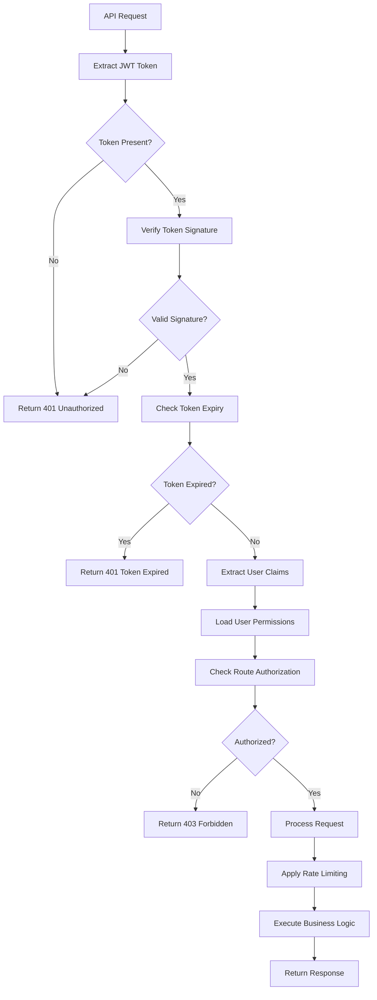

### 🔒 **Data Protection Flow**

```javascript
// Data Encryption/Decryption Workflow
const dataProtectionMiddleware = async (req, res, next) => {
  try {
    // 1. Input Sanitization
    req.body = sanitizeInput(req.body);
    
    // 2. Encrypt Sensitive Data
    if (req.body.sensitiveData) {
      req.body.sensitiveData = await encrypt(req.body.sensitiveData);
    }
    
    // 3. Validate CSRF Token
    if (['POST', 'PUT', 'DELETE'].includes(req.method)) {
      await validateCSRFToken(req);
    }
    
    // 4. Apply Security Headers
    res.setSecurityHeaders();
    
    next();
  } catch (error) {
    return res.status(400).json({ error: 'Security validation failed' });
  }
};
```

---

## 📊 **Performance Monitoring Flows**

### 📈 **Request Performance Tracking**

```javascript
// Performance Monitoring Implementation
const performanceMiddleware = (req, res, next) => {
  const startTime = Date.now();
  
  res.on('finish', () => {
    const endTime = Date.now();
    const responseTime = endTime - startTime;
    
    // Log performance metrics
    logger.info('Request Performance', {
      method: req.method,
      url: req.url,
      statusCode: res.statusCode,
      responseTime: responseTime,
      userAgent: req.get('User-Agent'),
      ip: req.ip
    });
    
    // Alert if response time is too high
    if (responseTime > 5000) { // 5 seconds
      logger.warn('Slow Request Detected', {
        url: req.url,
        responseTime: responseTime
      });
    }
  });
  
  next();
};
```

---

## 🔗 **Related Documentation**
- [User Types & Workflows](./USER_TYPES_AND_WORKFLOWS.md)
- [API Complete Documentation](./API_COMPLETE_DOCUMENTATION.md)
- [Security Analysis](../COMPREHENSIVE_PRODUCTION_ANALYSIS.md)
- [Deployment Guide](../FINAL_DEPLOYMENT_CHECKLIST.md)

---

**Last Updated:** September 13, 2025  
**Version:** 1.0.0  
**Status:** ✅ Production Ready

---

*This documentation is part of the EatFast food delivery platform - connecting Cameroon through technology*
