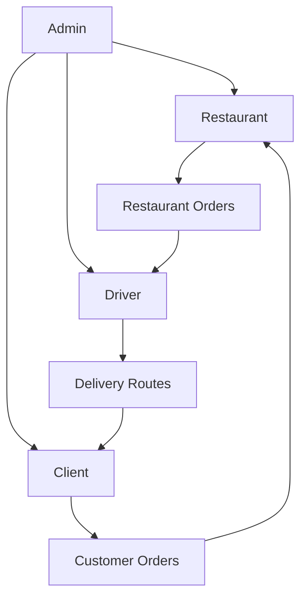
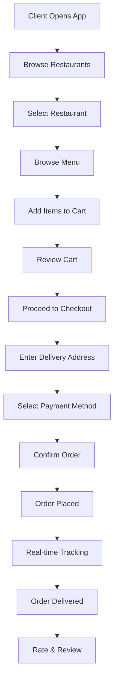
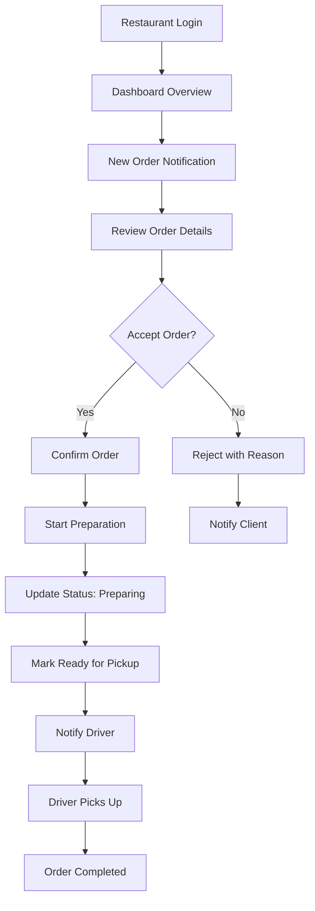
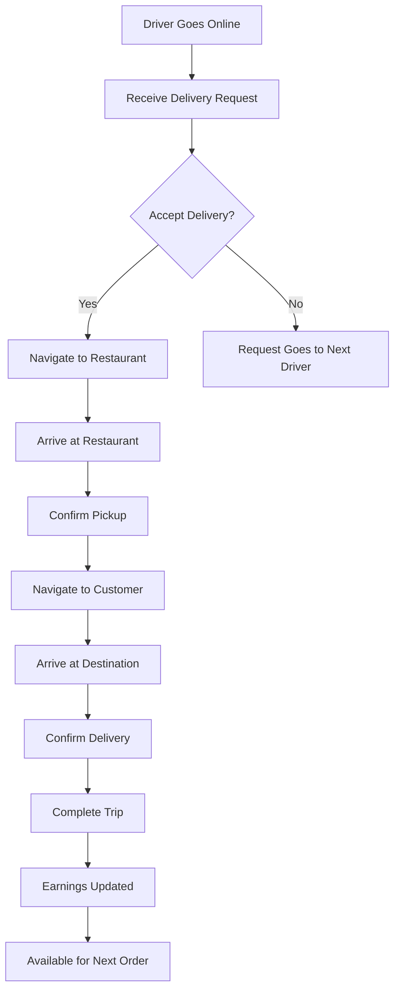
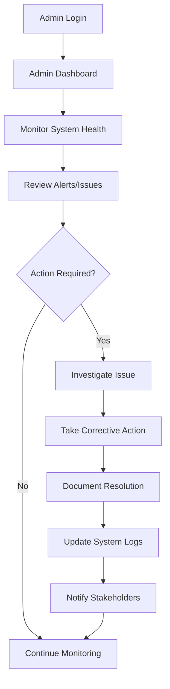
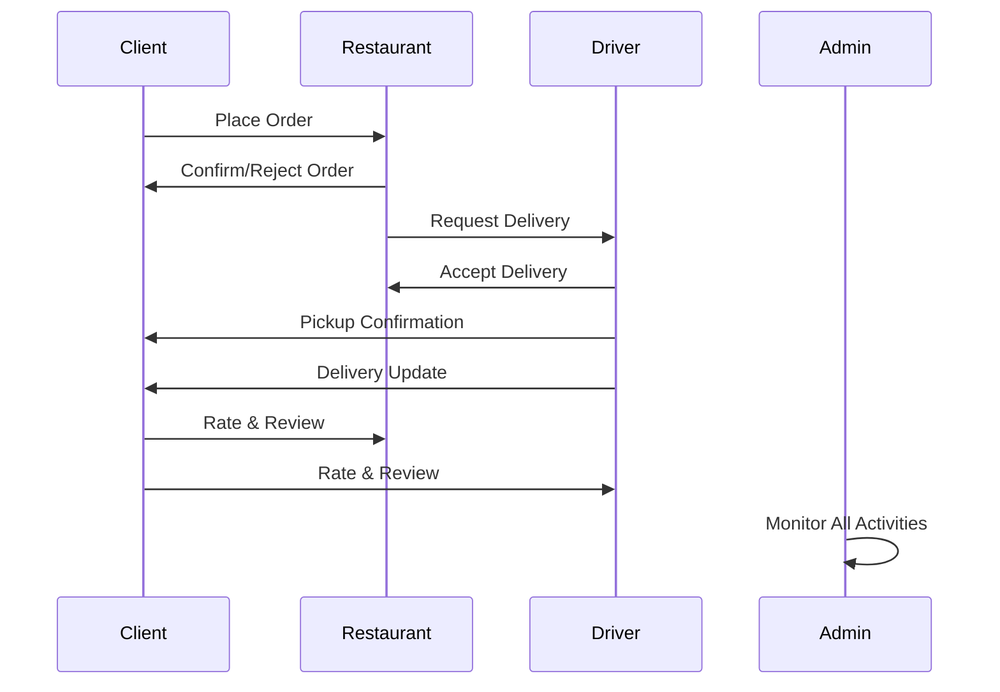

# 👥 **EatFast User Types & Workflows Documentation**

## 📋 **Table of Contents**
- [Overview](#overview)
- [User Type Hierarchy](#user-type-hierarchy)
- [Client User Type](#client-user-type)
- [Restaurant User Type](#restaurant-user-type)
- [Driver User Type](#driver-user-type)
- [Admin User Type](#admin-user-type)
- [Cross-User Interactions](#cross-user-interactions)
- [JSON Schemas](#json-schemas)

---

## 📖 **Overview**

EatFast supports four distinct user types, each with specific roles, permissions, and workflows:

| User Type | Primary Role | Access Level | Key Features |
|-----------|--------------|--------------|--------------|
| **Client** | Food Ordering | Basic | Browse, Order, Track, Pay |
| **Restaurant** | Food Provider | Business | Menu Management, Order Processing |
| **Driver** | Delivery Service | Service | Order Pickup, Route Navigation, Delivery |
| **Admin** | System Management | Full | User Management, Analytics, Configuration |

---

## 🏗️ **User Type Hierarchy**



---

## 🛍️ **Client User Type**

### **Role Definition**
End customers who browse restaurants, place orders, make payments, and track deliveries.

### **Core Capabilities**
- **Account Management:** Registration, profile updates, password management
- **Restaurant Discovery:** Browse by category, location, rating, cuisine type
- **Order Management:** Cart management, checkout process, order history
- **Payment Processing:** Multiple payment methods, secure transactions
- **Real-time Tracking:** Live order status, driver location tracking
- **Reviews & Ratings:** Restaurant and driver feedback system

### **Action Flow Diagram**


### **API Endpoints**
```javascript
// Authentication
POST /api/auth/register/client
POST /api/auth/login
POST /api/auth/logout
POST /api/auth/refresh-token

// Profile Management
GET /api/client/profile
PUT /api/client/profile
PUT /api/client/change-password
DELETE /api/client/account

// Restaurant & Menu
GET /api/restaurants
GET /api/restaurants/:id
GET /api/restaurants/:id/menu
GET /api/restaurants/search?category=&location=&rating=

// Order Management
POST /api/orders
GET /api/orders/history
GET /api/orders/:id
PUT /api/orders/:id/cancel
GET /api/orders/:id/track

// Payment
POST /api/payments/process
GET /api/payments/methods
POST /api/payments/methods
DELETE /api/payments/methods/:id

// Reviews
POST /api/reviews/restaurant/:id
POST /api/reviews/driver/:id
GET /api/reviews/my-reviews
```

### **Permission Matrix**
| Action | Client | Restaurant | Driver | Admin |
|--------|--------|------------|--------|-------|
| Place Order | ✅ | ❌ | ❌ | ✅ |
| View Menu | ✅ | ✅ | ❌ | ✅ |
| Track Order | ✅ | ✅ | ✅ | ✅ |
| Cancel Order | ✅ (within 5min) | ✅ | ❌ | ✅ |
| Rate Restaurant | ✅ | ❌ | ❌ | ✅ |

---

## 🍽️ **Restaurant User Type**

### **Role Definition**
Business owners/managers who manage restaurant profiles, menus, orders, and business analytics.

### **Core Capabilities**
- **Business Profile:** Restaurant details, operating hours, delivery zones
- **Menu Management:** Items, categories, prices, availability, images
- **Order Processing:** Accept/reject orders, preparation status updates
- **Analytics Dashboard:** Sales reports, popular items, customer insights
- **Staff Management:** Employee accounts, role assignments
- **Promotional Tools:** Discounts, special offers, featured items

### **Action Flow Diagram**


### **API Endpoints**
```javascript
// Authentication & Profile
POST /api/auth/register/restaurant
GET /api/restaurant/profile
PUT /api/restaurant/profile
PUT /api/restaurant/operating-hours
POST /api/restaurant/upload-images

// Menu Management
GET /api/restaurant/menu
POST /api/restaurant/menu/items
PUT /api/restaurant/menu/items/:id
DELETE /api/restaurant/menu/items/:id
PUT /api/restaurant/menu/items/:id/availability

// Order Management
GET /api/restaurant/orders/pending
GET /api/restaurant/orders/active
PUT /api/restaurant/orders/:id/accept
PUT /api/restaurant/orders/:id/reject
PUT /api/restaurant/orders/:id/status

// Analytics
GET /api/restaurant/analytics/sales
GET /api/restaurant/analytics/popular-items
GET /api/restaurant/analytics/customer-feedback
GET /api/restaurant/analytics/performance

// Staff Management
GET /api/restaurant/staff
POST /api/restaurant/staff
PUT /api/restaurant/staff/:id
DELETE /api/restaurant/staff/:id
```

### **Order Status Management**
```javascript
// Order Status Flow for Restaurants
const orderStatuses = {
  PENDING: 'pending',           // Waiting for restaurant confirmation
  ACCEPTED: 'accepted',         // Restaurant accepted the order
  REJECTED: 'rejected',         // Restaurant rejected the order
  PREPARING: 'preparing',       // Food is being prepared
  READY_FOR_PICKUP: 'ready_for_pickup',  // Ready for driver pickup
  PICKED_UP: 'picked_up',       // Driver picked up the order
  DELIVERED: 'delivered'        // Order delivered to customer
};
```

---

## 🚗 **Driver User Type**

### **Role Definition**
Delivery personnel who handle order pickups, transportation, and customer deliveries.

### **Core Capabilities**
- **Route Optimization:** GPS navigation, efficient delivery routes
- **Order Assignment:** Accept/decline delivery requests
- **Real-time Updates:** Location sharing, delivery status updates
- **Earnings Tracking:** Income reports, trip history, performance metrics
- **Vehicle Management:** Vehicle registration, documentation updates
- **Customer Communication:** In-app messaging, delivery notifications

### **Action Flow Diagram**


### **API Endpoints**
```javascript
// Authentication & Profile
POST /api/auth/register/driver
GET /api/driver/profile
PUT /api/driver/profile
PUT /api/driver/vehicle-info
POST /api/driver/documents

// Availability & Status
PUT /api/driver/status/online
PUT /api/driver/status/offline
PUT /api/driver/location
GET /api/driver/status

// Order Management
GET /api/driver/available-orders
PUT /api/driver/orders/:id/accept
PUT /api/driver/orders/:id/decline
GET /api/driver/orders/active
PUT /api/driver/orders/:id/pickup-confirm
PUT /api/driver/orders/:id/delivery-confirm

// Earnings & Analytics
GET /api/driver/earnings/today
GET /api/driver/earnings/week
GET /api/driver/earnings/month
GET /api/driver/trips/history
GET /api/driver/performance/rating
```

### **Location Tracking System**
```javascript
// Real-time location sharing
const locationUpdate = {
  driverId: 'driver_123',
  latitude: 3.848,
  longitude: 11.502,
  timestamp: new Date(),
  accuracy: 10, // meters
  heading: 45, // degrees
  speed: 25 // km/h
};

// Socket.IO events for real-time tracking
socket.emit('driver:location-update', locationUpdate);
socket.on('order:route-update', (routeData) => {
  // Update navigation with new route
});
```

---

## 👨‍💼 **Admin User Type**

### **Role Definition**
System administrators with full access to manage users, monitor system performance, and configure platform settings.

### **Core Capabilities**
- **User Management:** Create, modify, suspend, delete all user types
- **System Monitoring:** Performance metrics, error tracking, usage analytics
- **Content Moderation:** Review reports, manage disputes, content approval
- **Financial Management:** Commission settings, payment processing, refunds
- **Security Management:** Access controls, audit logs, security policies
- **Platform Configuration:** System settings, feature flags, announcements

### **Action Flow Diagram**


### **API Endpoints**
```javascript
// User Management
GET /api/admin/users
GET /api/admin/users/:type
POST /api/admin/users
PUT /api/admin/users/:id
DELETE /api/admin/users/:id
PUT /api/admin/users/:id/suspend
PUT /api/admin/users/:id/activate

// System Analytics
GET /api/admin/analytics/overview
GET /api/admin/analytics/users
GET /api/admin/analytics/orders
GET /api/admin/analytics/revenue
GET /api/admin/analytics/performance

// Content Management
GET /api/admin/reports
PUT /api/admin/reports/:id/resolve
GET /api/admin/reviews/flagged
PUT /api/admin/reviews/:id/moderate

// Financial Management
GET /api/admin/finances/transactions
GET /api/admin/finances/commissions
PUT /api/admin/finances/commission-rates
POST /api/admin/finances/refunds

// System Configuration
GET /api/admin/config
PUT /api/admin/config
GET /api/admin/logs
POST /api/admin/announcements
```

---

## 🔄 **Cross-User Interactions**

### **Order Lifecycle Interactions**


### **Communication Channels**
- **Client ↔ Restaurant:** Order queries, special requests
- **Client ↔ Driver:** Delivery instructions, location updates
- **Restaurant ↔ Driver:** Pickup coordination, order details
- **Admin ↔ All:** System announcements, support resolution

---

## 📊 **JSON Schemas**

### **Client Schema**
```json
{
  "$schema": "http://json-schema.org/draft-07/schema#",
  "type": "object",
  "title": "Client User Schema",
  "properties": {
    "id": {
      "type": "string",
      "format": "uuid",
      "description": "Unique client identifier"
    },
    "email": {
      "type": "string",
      "format": "email",
      "description": "Client email address"
    },
    "phone": {
      "type": "string",
      "pattern": "^\\+237[0-9]{9}$",
      "description": "Cameroon phone number"
    },
    "firstName": {
      "type": "string",
      "minLength": 2,
      "maxLength": 50
    },
    "lastName": {
      "type": "string",
      "minLength": 2,
      "maxLength": 50
    },
    "addresses": {
      "type": "array",
      "items": {
        "type": "object",
        "properties": {
          "id": {"type": "string", "format": "uuid"},
          "label": {"type": "string", "enum": ["home", "work", "other"]},
          "street": {"type": "string"},
          "city": {"type": "string"},
          "region": {"type": "string"},
          "postalCode": {"type": "string"},
          "coordinates": {
            "type": "object",
            "properties": {
              "latitude": {"type": "number"},
              "longitude": {"type": "number"}
            }
          },
          "isDefault": {"type": "boolean"}
        },
        "required": ["label", "street", "city", "coordinates"]
      }
    },
    "preferences": {
      "type": "object",
      "properties": {
        "cuisineTypes": {
          "type": "array",
          "items": {"type": "string"}
        },
        "dietaryRestrictions": {
          "type": "array",
          "items": {"type": "string", "enum": ["vegetarian", "vegan", "halal", "gluten-free", "dairy-free"]}
        },
        "spiceLevel": {"type": "string", "enum": ["mild", "medium", "hot", "very-hot"]},
        "notifications": {
          "type": "object",
          "properties": {
            "orderUpdates": {"type": "boolean"},
            "promotions": {"type": "boolean"},
            "newRestaurants": {"type": "boolean"}
          }
        }
      }
    },
    "loyaltyPoints": {"type": "integer", "minimum": 0},
    "totalOrders": {"type": "integer", "minimum": 0},
    "averageRating": {"type": "number", "minimum": 1, "maximum": 5},
    "status": {"type": "string", "enum": ["active", "suspended", "inactive"]},
    "createdAt": {"type": "string", "format": "date-time"},
    "lastLoginAt": {"type": "string", "format": "date-time"}
  },
  "required": ["email", "phone", "firstName", "lastName"]
}
```

### **Restaurant Schema**
```json
{
  "$schema": "http://json-schema.org/draft-07/schema#",
  "type": "object",
  "title": "Restaurant User Schema",
  "properties": {
    "id": {
      "type": "string",
      "format": "uuid",
      "description": "Unique restaurant identifier"
    },
    "email": {
      "type": "string",
      "format": "email"
    },
    "phone": {
      "type": "string",
      "pattern": "^\\+237[0-9]{9}$"
    },
    "businessName": {
      "type": "string",
      "minLength": 2,
      "maxLength": 100
    },
    "businessType": {
      "type": "string",
      "enum": ["restaurant", "fast-food", "cafe", "bakery", "food-truck", "catering"]
    },
    "cuisineTypes": {
      "type": "array",
      "items": {
        "type": "string",
        "enum": ["african", "european", "asian", "american", "middle-eastern", "fusion", "seafood", "vegetarian", "desserts"]
      }
    },
    "address": {
      "type": "object",
      "properties": {
        "street": {"type": "string"},
        "city": {"type": "string"},
        "region": {"type": "string"},
        "postalCode": {"type": "string"},
        "coordinates": {
          "type": "object",
          "properties": {
            "latitude": {"type": "number"},
            "longitude": {"type": "number"}
          },
          "required": ["latitude", "longitude"]
        }
      },
      "required": ["street", "city", "coordinates"]
    },
    "operatingHours": {
      "type": "object",
      "properties": {
        "monday": {"$ref": "#/definitions/daySchedule"},
        "tuesday": {"$ref": "#/definitions/daySchedule"},
        "wednesday": {"$ref": "#/definitions/daySchedule"},
        "thursday": {"$ref": "#/definitions/daySchedule"},
        "friday": {"$ref": "#/definitions/daySchedule"},
        "saturday": {"$ref": "#/definitions/daySchedule"},
        "sunday": {"$ref": "#/definitions/daySchedule"}
      }
    },
    "deliveryZones": {
      "type": "array",
      "items": {
        "type": "object",
        "properties": {
          "name": {"type": "string"},
          "radius": {"type": "number", "minimum": 1, "maximum": 50},
          "deliveryFee": {"type": "number", "minimum": 0},
          "minimumOrder": {"type": "number", "minimum": 0}
        }
      }
    },
    "menu": {
      "type": "array",
      "items": {
        "type": "object",
        "properties": {
          "id": {"type": "string", "format": "uuid"},
          "name": {"type": "string"},
          "description": {"type": "string"},
          "price": {"type": "number", "minimum": 0},
          "category": {"type": "string"},
          "images": {
            "type": "array",
            "items": {"type": "string", "format": "uri"}
          },
          "ingredients": {
            "type": "array",
            "items": {"type": "string"}
          },
          "allergens": {
            "type": "array",
            "items": {"type": "string"}
          },
          "isAvailable": {"type": "boolean"},
          "preparationTime": {"type": "integer", "minimum": 5, "maximum": 120},
          "nutritionInfo": {
            "type": "object",
            "properties": {
              "calories": {"type": "integer"},
              "protein": {"type": "number"},
              "carbs": {"type": "number"},
              "fat": {"type": "number"}
            }
          }
        },
        "required": ["name", "price", "category", "preparationTime"]
      }
    },
    "rating": {"type": "number", "minimum": 1, "maximum": 5},
    "totalReviews": {"type": "integer", "minimum": 0},
    "isVerified": {"type": "boolean"},
    "isFeatured": {"type": "boolean"},
    "status": {"type": "string", "enum": ["active", "suspended", "pending-approval", "closed"]},
    "businessLicense": {"type": "string"},
    "taxId": {"type": "string"},
    "bankDetails": {
      "type": "object",
      "properties": {
        "bankName": {"type": "string"},
        "accountNumber": {"type": "string"},
        "accountName": {"type": "string"},
        "swiftCode": {"type": "string"}
      }
    }
  },
  "required": ["email", "phone", "businessName", "businessType", "address"],
  "definitions": {
    "daySchedule": {
      "type": "object",
      "properties": {
        "isOpen": {"type": "boolean"},
        "openTime": {"type": "string", "pattern": "^([0-1]?[0-9]|2[0-3]):[0-5][0-9]$"},
        "closeTime": {"type": "string", "pattern": "^([0-1]?[0-9]|2[0-3]):[0-5][0-9]$"}
      }
    }
  }
}
```

### **Driver Schema**
```json
{
  "$schema": "http://json-schema.org/draft-07/schema#",
  "type": "object",
  "title": "Driver User Schema",
  "properties": {
    "id": {
      "type": "string",
      "format": "uuid",
      "description": "Unique driver identifier"
    },
    "email": {
      "type": "string",
      "format": "email"
    },
    "phone": {
      "type": "string",
      "pattern": "^\\+237[0-9]{9}$"
    },
    "firstName": {
      "type": "string",
      "minLength": 2,
      "maxLength": 50
    },
    "lastName": {
      "type": "string",
      "minLength": 2,
      "maxLength": 50
    },
    "dateOfBirth": {
      "type": "string",
      "format": "date"
    },
    "nationalId": {
      "type": "string",
      "description": "National ID card number"
    },
    "drivingLicense": {
      "type": "object",
      "properties": {
        "number": {"type": "string"},
        "expiryDate": {"type": "string", "format": "date"},
        "category": {"type": "string", "enum": ["A", "B", "C", "D"]},
        "documentUrl": {"type": "string", "format": "uri"}
      },
      "required": ["number", "expiryDate", "category"]
    },
    "vehicle": {
      "type": "object",
      "properties": {
        "type": {"type": "string", "enum": ["motorcycle", "car", "bicycle", "scooter"]},
        "make": {"type": "string"},
        "model": {"type": "string"},
        "year": {"type": "integer", "minimum": 2000},
        "plateNumber": {"type": "string"},
        "color": {"type": "string"},
        "insurance": {
          "type": "object",
          "properties": {
            "provider": {"type": "string"},
            "policyNumber": {"type": "string"},
            "expiryDate": {"type": "string", "format": "date"},
            "documentUrl": {"type": "string", "format": "uri"}
          }
        },
        "registrationUrl": {"type": "string", "format": "uri"}
      },
      "required": ["type", "plateNumber", "insurance"]
    },
    "workingAreas": {
      "type": "array",
      "items": {
        "type": "object",
        "properties": {
          "city": {"type": "string"},
          "regions": {
            "type": "array",
            "items": {"type": "string"}
          }
        }
      }
    },
    "availability": {
      "type": "object",
      "properties": {
        "isOnline": {"type": "boolean"},
        "currentLocation": {
          "type": "object",
          "properties": {
            "latitude": {"type": "number"},
            "longitude": {"type": "number"},
            "lastUpdated": {"type": "string", "format": "date-time"}
          }
        },
        "workingHours": {
          "type": "object",
          "properties": {
            "monday": {"$ref": "#/definitions/timeSlot"},
            "tuesday": {"$ref": "#/definitions/timeSlot"},
            "wednesday": {"$ref": "#/definitions/timeSlot"},
            "thursday": {"$ref": "#/definitions/timeSlot"},
            "friday": {"$ref": "#/definitions/timeSlot"},
            "saturday": {"$ref": "#/definitions/timeSlot"},
            "sunday": {"$ref": "#/definitions/timeSlot"}
          }
        }
      }
    },
    "performance": {
      "type": "object",
      "properties": {
        "rating": {"type": "number", "minimum": 1, "maximum": 5},
        "totalDeliveries": {"type": "integer", "minimum": 0},
        "successRate": {"type": "number", "minimum": 0, "maximum": 100},
        "averageDeliveryTime": {"type": "integer", "minimum": 0},
        "totalEarnings": {"type": "number", "minimum": 0},
        "lastDelivery": {"type": "string", "format": "date-time"}
      }
    },
    "documents": {
      "type": "object",
      "properties": {
        "profilePhoto": {"type": "string", "format": "uri"},
        "idCardFront": {"type": "string", "format": "uri"},
        "idCardBack": {"type": "string", "format": "uri"},
        "bankStatement": {"type": "string", "format": "uri"}
      }
    },
    "bankDetails": {
      "type": "object",
      "properties": {
        "bankName": {"type": "string"},
        "accountNumber": {"type": "string"},
        "accountName": {"type": "string"}
      }
    },
    "emergencyContact": {
      "type": "object",
      "properties": {
        "name": {"type": "string"},
        "phone": {"type": "string"},
        "relationship": {"type": "string"}
      }
    },
    "status": {"type": "string", "enum": ["active", "suspended", "pending-approval", "inactive"]},
    "isVerified": {"type": "boolean"},
    "joinedAt": {"type": "string", "format": "date-time"}
  },
  "required": ["email", "phone", "firstName", "lastName", "nationalId", "drivingLicense", "vehicle"],
  "definitions": {
    "timeSlot": {
      "type": "object",
      "properties": {
        "isAvailable": {"type": "boolean"},
        "startTime": {"type": "string", "pattern": "^([0-1]?[0-9]|2[0-3]):[0-5][0-9]$"},
        "endTime": {"type": "string", "pattern": "^([0-1]?[0-9]|2[0-3]):[0-5][0-9]$"}
      }
    }
  }
}
```

### **Admin Schema**
```json
{
  "$schema": "http://json-schema.org/draft-07/schema#",
  "type": "object",
  "title": "Admin User Schema",
  "properties": {
    "id": {
      "type": "string",
      "format": "uuid",
      "description": "Unique admin identifier"
    },
    "email": {
      "type": "string",
      "format": "email"
    },
    "firstName": {
      "type": "string",
      "minLength": 2,
      "maxLength": 50
    },
    "lastName": {
      "type": "string",
      "minLength": 2,
      "maxLength": 50
    },
    "role": {
      "type": "string",
      "enum": ["super-admin", "admin", "moderator", "support"]
    },
    "permissions": {
      "type": "array",
      "items": {
        "type": "string",
        "enum": [
          "user-management",
          "order-management", 
          "financial-management",
          "content-moderation",
          "system-configuration",
          "analytics-access",
          "security-management",
          "audit-log-access"
        ]
      }
    },
    "department": {
      "type": "string",
      "enum": ["operations", "customer-service", "finance", "technical", "marketing"]
    },
    "accessLevel": {
      "type": "string",
      "enum": ["read-only", "standard", "elevated", "full-access"]
    },
    "lastLoginAt": {"type": "string", "format": "date-time"},
    "loginAttempts": {"type": "integer", "minimum": 0, "maximum": 5},
    "isActive": {"type": "boolean"},
    "mfaEnabled": {"type": "boolean"},
    "sessionTimeout": {"type": "integer", "minimum": 300, "maximum": 86400},
    "createdBy": {"type": "string", "format": "uuid"},
    "createdAt": {"type": "string", "format": "date-time"}
  },
  "required": ["email", "firstName", "lastName", "role", "permissions", "accessLevel"]
}
```

### **Order Schema (Cross-User)**
```json
{
  "$schema": "http://json-schema.org/draft-07/schema#",
  "type": "object",
  "title": "Order Schema",
  "properties": {
    "id": {
      "type": "string",
      "format": "uuid",
      "description": "Unique order identifier"
    },
    "orderNumber": {
      "type": "string",
      "pattern": "^EF[0-9]{8}$",
      "description": "Human-readable order number"
    },
    "clientId": {"type": "string", "format": "uuid"},
    "restaurantId": {"type": "string", "format": "uuid"},
    "driverId": {"type": "string", "format": "uuid"},
    "status": {
      "type": "string",
      "enum": ["pending", "accepted", "rejected", "preparing", "ready_for_pickup", "picked_up", "delivered", "cancelled"]
    },
    "items": {
      "type": "array",
      "items": {
        "type": "object",
        "properties": {
          "menuItemId": {"type": "string", "format": "uuid"},
          "name": {"type": "string"},
          "price": {"type": "number", "minimum": 0},
          "quantity": {"type": "integer", "minimum": 1},
          "specialInstructions": {"type": "string"},
          "modifications": {
            "type": "array",
            "items": {
              "type": "object",
              "properties": {
                "type": {"type": "string"},
                "name": {"type": "string"},
                "priceAdjustment": {"type": "number"}
              }
            }
          }
        },
        "required": ["menuItemId", "name", "price", "quantity"]
      }
    },
    "deliveryAddress": {
      "type": "object",
      "properties": {
        "street": {"type": "string"},
        "city": {"type": "string"},
        "coordinates": {
          "type": "object",
          "properties": {
            "latitude": {"type": "number"},
            "longitude": {"type": "number"}
          }
        },
        "instructions": {"type": "string"}
      },
      "required": ["street", "city", "coordinates"]
    },
    "payment": {
      "type": "object",
      "properties": {
        "method": {"type": "string", "enum": ["cash", "mobile-money", "card", "wallet"]},
        "status": {"type": "string", "enum": ["pending", "processing", "completed", "failed", "refunded"]},
        "transactionId": {"type": "string"},
        "amount": {"type": "number", "minimum": 0}
      }
    },
    "pricing": {
      "type": "object",
      "properties": {
        "subtotal": {"type": "number", "minimum": 0},
        "deliveryFee": {"type": "number", "minimum": 0},
        "tax": {"type": "number", "minimum": 0},
        "discount": {"type": "number", "minimum": 0},
        "total": {"type": "number", "minimum": 0}
      }
    },
    "timeline": {
      "type": "object",
      "properties": {
        "orderPlaced": {"type": "string", "format": "date-time"},
        "restaurantConfirmed": {"type": "string", "format": "date-time"},
        "preparationStarted": {"type": "string", "format": "date-time"},
        "readyForPickup": {"type": "string", "format": "date-time"},
        "driverAssigned": {"type": "string", "format": "date-time"},
        "pickedUp": {"type": "string", "format": "date-time"},
        "delivered": {"type": "string", "format": "date-time"}
      }
    },
    "estimatedDeliveryTime": {"type": "string", "format": "date-time"},
    "actualDeliveryTime": {"type": "string", "format": "date-time"},
    "ratings": {
      "type": "object",
      "properties": {
        "restaurant": {
          "type": "object",
          "properties": {
            "rating": {"type": "number", "minimum": 1, "maximum": 5},
            "comment": {"type": "string"}
          }
        },
        "driver": {
          "type": "object",
          "properties": {
            "rating": {"type": "number", "minimum": 1, "maximum": 5},
            "comment": {"type": "string"}
          }
        }
      }
    }
  },
  "required": ["clientId", "restaurantId", "status", "items", "deliveryAddress", "payment", "pricing"]
}
```

---

## 🔗 **Related Documentation**
- [API Complete Documentation](./API_COMPLETE_DOCUMENTATION.md)
- [Security Analysis](../COMPREHENSIVE_PRODUCTION_ANALYSIS.md)
- [Deployment Guide](../FINAL_DEPLOYMENT_CHECKLIST.md)
- [System Architecture](../README.md#architecture)

---

**Last Updated:** September 13, 2025  
**Version:** 1.0.0  
**Status:** ✅ Production Ready

---

*This documentation is part of the EatFast food delivery platform - connecting Cameroon through technology*
